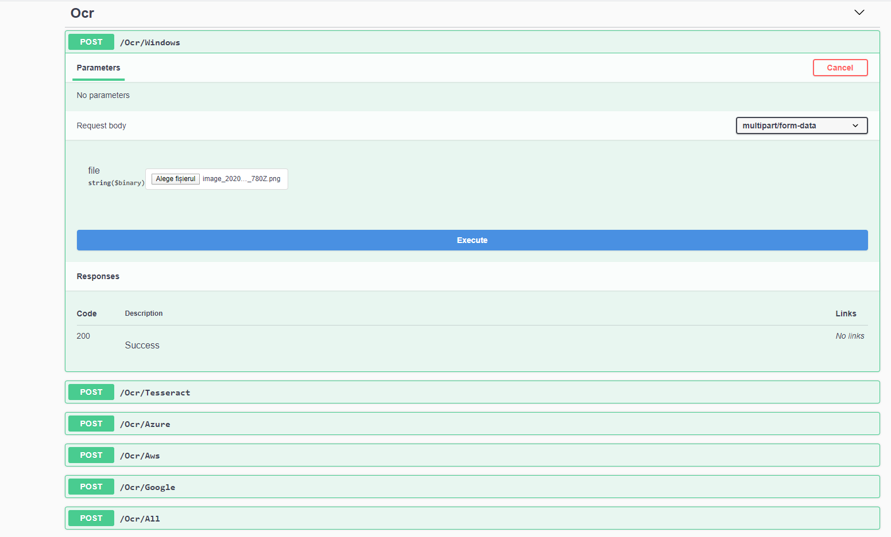

 [![Nuget][nuget-badge]][nuget-url]

[nuget-badge]: https://img.shields.io/nuget/v/Ocr.Wrapper
[nuget-url]: https://www.nuget.org/packages/Ocr.Wrapper/
# Ocr.Wrapper
This is still in alpha state and we are planning to update some of the API's


It is a wrapper with minimal dependencies that helps you run and compare the most popular OCR services
For now we support the following: Windows, Azure Vision, Tesseract, Google OCR, AWs Rekognition

Code example to use with Azure Ocr Service:
```C#
[TestMethod()]
public async Task AzureOcr()
{
    var subscriptionKey = ConfigurationManager.AppSettings["azureSubscriptionKey"];
    var endpoint = ConfigurationManager.AppSettings["azureEndpoint"];


    AzureOcrService azureOcrExecutor = new AzureOcrService(subscriptionKey, endpoint);
    AzureOcrResults result = await azureOcrExecutor.GetOcrResultAsync(@"data/abc.JPG");
    Assert.IsNotNull(result);
    GenericOcrResponse genericResult = result.Map();
    Assert.IsNotNull(genericResult);
}
```

Code example to use Windows OCR:

Tested on Windows 10 and Windows Server 2016 Datacenter version on Azure and it works. It should work also in Windows Server 2019 full.

Not such a known OCR, but from my tests, for a lot of formats it's giving impressing results.
```C#
[TestMethod()]
public async Task WindowsOcr()
{
    WindowsOcrService windowsOcrExecutor = new WindowsOcrService();
    WindowsOcrResult result = await windowsOcrExecutor.GetOcrResultAsync(@"data/abc.JPG", "en");
    Assert.IsNotNull(result);
    GenericOcrResponse genericResult = result.Map();
    Assert.IsNotNull(genericResult);
}
```


Tesseract example: This is one of the most known OCR frameworks, we are basically just a wrapper around the executable.

Tesseract must be installed in order for this to work.

For Windows 10 X64 we have a class: TesseractInstaller that can be used to automatically install Tesseract(just copy binaries)
```C#
[TestMethod]
public async Task Tesseract5()
{
    TesseractOcrService tesseractService = new TesseractOcrService();
    TesseractResponse result = await tesseractService.GetOcrResultAsync(@"data/abc.JPG", "eng");
    Assert.IsNotNull(result);
    GenericOcrResponse genericResult = result.Map();
    Assert.IsNotNull(genericResult);
}
```

Google OCR Service example
```C#
[TestMethod]
public async Task GoogleOCR()
{
    var apiToken = ConfigurationManager.AppSettings["googleApiToken"];
    GoogleOcrService googleOcrService = new GoogleOcrService(apiToken);

    GoogleOcrResponse result = await googleOcrService.GetOcrResultAsync(@"data/abc.JPG");
    var descriptions = result.Responses.SelectMany(r => r.Annotations).ToList();
    Assert.IsNotNull(result);
    GenericOcrResponse genericResult = result.Map();
    Assert.IsNotNull(genericResult);
}
```

AWS Rekognition OCR example
```C#
[TestMethod]
public async Task AwsOcr()
{
    var accessKey = ConfigurationManager.AppSettings["awsAccessKey"];
    var secretKey = ConfigurationManager.AppSettings["awsSecretKey"];
    AwsOcrService awsOcrService = new AwsOcrService(accessKey, secretKey);
    AwsOcrResponse result = await awsOcrService.GetOcrResultAsync(@"data/abc.JPG");
    Assert.IsNotNull(result);
    GenericOcrResponse genericResult = result.Map();
    Assert.IsNotNull(genericResult);
}
```

A way to run all OCRs and get all responses (On settings you can configure Tesseract to be automatically installed)
```C#
[TestMethod]
public async Task RunAllOcrs()
{
    StandardOcrSettings standardOcrSettings = GetStandardOcrSettings();

    MultiOcrRunner genericOcrRunner = await new StandardMultiOcrRunnerFactory(standardOcrSettings)
        .GetMultiOcrRunner();
    Dictionary<string, GenericOcrResponse> results = await genericOcrRunner.RunAllOcrEnginesOnImage(@"data/abc.JPG");
    Assert.IsNotNull(results);
}
```

You can configure file storage to use to cache the results - interface from Foundatio project, so multiple file storage options are available - https://github.com/FoundatioFx/Foundatio#file-storage
```C#
[TestMethod]
public async Task RunOcrsWithCache()
{
    StandardOcrSettings standardOcrSettings = GetStandardOcrSettings();

    var fullPath = Path.GetFullPath(@"..\Data\Cache\");
    MultiOcrRunner multiOcrRunner = await new StandardMultiOcrRunnerFactory(standardOcrSettings, fullPath)
        .GetMultiOcrRunner();
    Dictionary<string, GenericOcrResponse> results = await multiOcrRunner.RunAllOcrEnginesOnImage(@"data/abc.JPG");
    Assert.IsNotNull(results);
}
```

```C#
private static StandardOcrSettings GetStandardOcrSettings()
{
    var azureSubscriptionKey = ConfigurationManager.AppSettings["azureSubscriptionKey"];
    var azureEndpoint = ConfigurationManager.AppSettings["azureEndpoint"];
    var googleApiToken = ConfigurationManager.AppSettings["googleApiToken"];
    var awsAcessKey = ConfigurationManager.AppSettings["awsAccessKey"];
    var awsSecretKey = ConfigurationManager.AppSettings["awsSecretKey"];
    StandardOcrSettings standardOcrSettings = new StandardOcrSettings(true)
    {
        AwsOcrSettings = new AwsOcrSettings(awsAcessKey, awsSecretKey),
        AzureOcrSettings = new AzureOcrSettings(azureSubscriptionKey, azureEndpoint),
        GoogleOcrSettings = new GoogleOcrSettings(googleApiToken),
        TesseractOcrSettings = new TesseractOcrSettings(),
        WindowsOcrSettings = new WindowsOcrSettings()
    };
    return standardOcrSettings;
}
```
# Ocr.Wrapper.WebAPI
Web API project configured to run all OCR engines. (Tested with IISExpress/local run/windows docker/linux docker)
Default page is the Swagger UI that helps to invoke the API.


In order to configure all Cloud services set the following values in user secrets: "azure:SubscriptionKey", "azure:Endpoint",
"google:ApiToken", "aws:AccessKey","aws:SecretKey"

